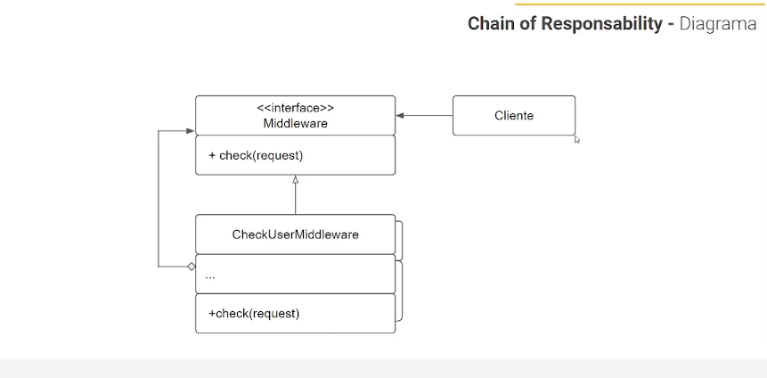

# Chain Of Responsibility 

- Esse padrão nos permiti adicionar comportamentos no nosso código que serão acionados apenas se o comportamento anterior ter sido um sucesso.
- Funciona com uma esteira de regras, não faz sentindo continuar para a próxima validação caso a atual falhou.
- Isso nos permite ter uma flexibilidade na adição de regras, e tambem um ganho no processamento, não será processado alguns cenários caso o anterior não for validado.

# Middlewares

- As classes middlewares serão os intermediadores do nosso objetivo.
- No nosso exemplo a classe server é o alvo e os middlewares farão as validações, intermediando o alvo final.
- Na classe de aplicação criaremos os "pipeline", ou seja a sequencia das regras que deverão ser intermediados para validações.
- Cada classe de middleware terá uma responsabilidade a ser validada, caso retorne com sucesso, sera linkado (caso houver um próximo), para uma seguinte validação.