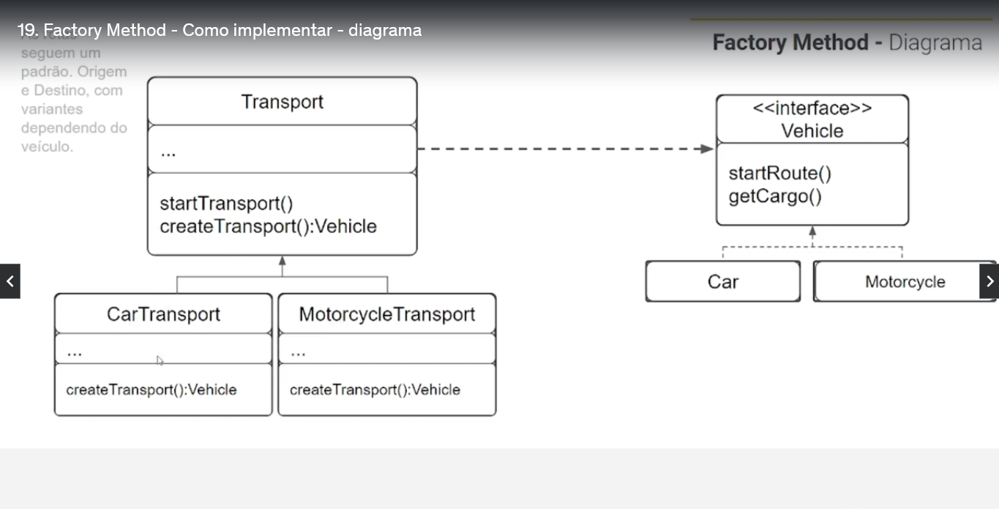

# Factory-Method

Este Desing-Pattern tem como objetivo criar uma fabrica de métodos, utilizando o SOLID por exemplo o principio aberto e fechado

- A classe abstrata **Transport** é a classe factory;
- As classes **CarTransport**, **MotorcycleTransport** e **BikeTransport** são as classes concretas que extendem de **Transport**;
- O método abstrato que é implementado por cada classe _concreta_ devolve uma instância *Vehicle*;
- As classes que **Car**, **Motorcycle** e **Bike** implemetam uma interface IVehicle quem tem métodos espcificos para cada transportes;
- A interface **IVehicle**, tem os métodos que cada tipo de veiculo deverá implementar;

`Em resumo os cada nova adição de tipo de veiculo os memos deverão respeitar os métodos da interface IVehicle.
E estes serão acessados pela nossa factory que tem como objetivo não ter alterações e somente extensões (Open-Closed)`