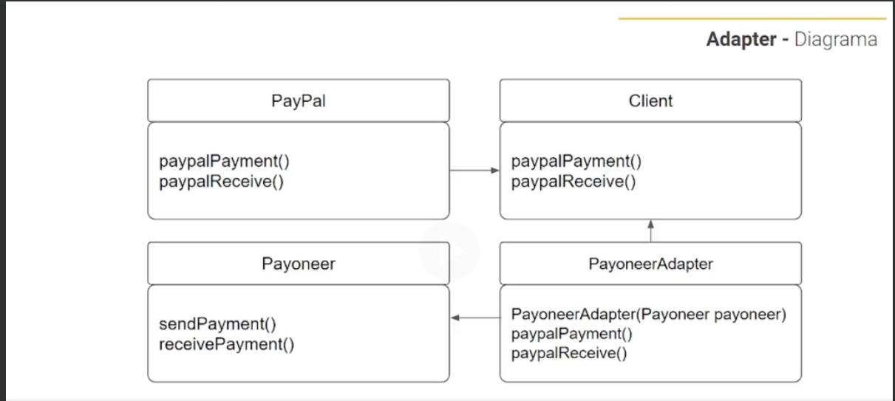

# Adapter

Quando temos uma aplicação ja criada e temos a necessidade de incluir mais um client, que tem como finalidade do client ja implementado, podemos utilizar o adpater para reaproveitar os métodos implementados.

``Neste exemplo temos uma API que ja esta funcionando para meio de pagamentos. O sistema envia pagamentos e recebe pagamento via PayPal respeitando sua assinatura.
Ao implementar mais clients como MercadoPago e Payoneer criamos uma classe adapter que utilizamos os métodos ja implementados (do PayPal) e adaptamos para a chamada do novo client``

- Cada provedor de pagamentos tem sua interface, respeitando a definição de assinatura de cada um. IMercadoPago, IPayoneer, IPayPal.
- O PayPal como pioneiro nessa API tem seus métodos sendo invocados em diversas partes do sistema, e que funcionam perfeitamente.
- Os provedores que vieram posteriormente ao PayPal, receberam uma classe de Adapter. IMercadoPagoAdapter, IPayoneerAdapter.
- As classes Adapter tem como objetivo assinar (implementar a inteface Paypal) os métodos que ja estão sendo usados em toda API. Os métodos serão implementados chamando os métodos da classe concreta de cada um deles (MercadoPago, Payoneer).