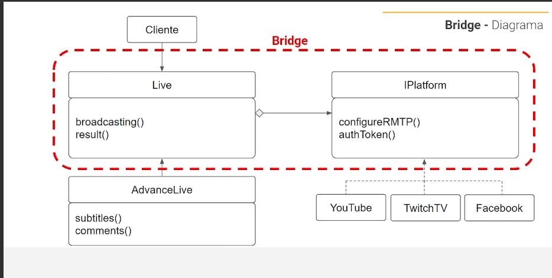

# Bridge

Quando temos diferentes implementações que tem a mesma abstração (mesmo comportamento final), com diferentes métodos de fazer a mesma função, podemos implementar o pattern bridge.

- No caso temos a classe Live, todas nossas Streamings tem o mesma abastração que é fazer uma live.
- No diretório platforms temos todas nossas implementações concretas que cada streaming vai implementar da sua forma.
- Todos streamings respeitará o contrato (interface) IPlatforms que conseguira manter a uniformidade do código base.
- Na classe de execução poderemos passar um factory, enviando uma instancia do plataforma que queremos executar a live
